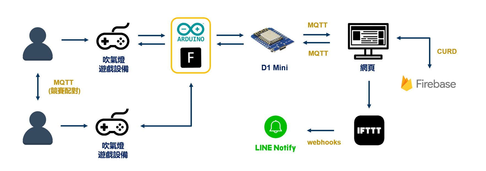
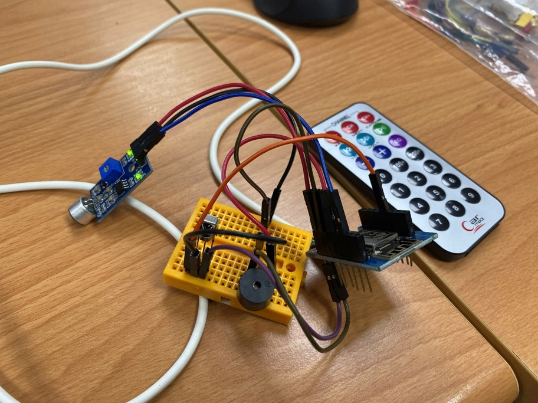

# BlowingLightGame

### 吹氣燈小遊戲
詳細內容可查閱<a href="assets/物聯網技術期末專題 - 吹氣燈遊戲(成果報告).pdf" donwolad>介紹文件</a>

## IoT感測器需求
1. 聲音感測器
2. 無源蜂鳴器
3. 紅外線遙控器
4. 紅外線接收頭
5. LED燈 (非必要)

感測器接腳(以D1 mini為例):
| 感測器類型 | 腳位編號 |
| -------- | -------- |
| 聲音感測器 | D1 |
| 無源蜂鳴器 | D3 |
| 紅外線接收 | D5 |
| LED燈 | D2 |

## IoT裝置程式
1. 利用旗標公司開發的Flags Block開啟[BlowingLightGame.xml](https://github.com/zhiao777774/BlowingLightGame/blob/master/BlowingLightGame.xml)檔案
2. 或利用Arduino開啟[BlowingLightGame/BlowingLightGame.ino](https://github.com/zhiao777774/BlowingLightGame/blob/master/BlowingLightGame/BlowingLightGame.ino)檔案

接著燒錄到開發版中(本系統以D1 mini為例)

## 遊戲網頁
開啟[index.html](https://github.com/zhiao777774/BlowingLightGame/blob/master/index.html)檔案